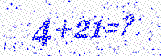
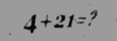
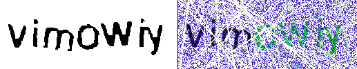

# Captcha Solving with OCR

## Table of contents
  - [Tools](#tools)
    - [Tesseract](#tesseract)
    - [`Image` crate](#image-crate)
  - [Simplest captchas](#simplest-captchas)
  - [Noisy captchas](#noisy-captchas)
  - [Google reCAPTCHA V2](#google-recaptcha-v2)
  - [Google reCAPTCHA V3](#google-recaptcha-v3)
  - [Complicated captchas](#complicated-captchas)

## Tools

### Tesseract

For OCR the goto tool is [tesseract](https://github.com/tesseract-ocr/tesseract). It's an open-source tool with a huge language recognition library and different modes provided.

Rust crates:
  - [rusty-tesseract](https://github.com/thomasgruebl/rusty-tesseract) has the easiest API, but uses a command to invoke tesseract CLI tool. Comes with `image` crate included.
  - [leptess](https://github.com/houqp/leptess) uses bindings instead and has a low-level access compared to those in C. A bit more complicated to use.

### `Image` crate

The [image](https://github.com/image-rs/image) crate is perfect for denoise in most captchas. Allows for loading images from memory and disk, has built-in transformation tools and access to pixels for your own transformation needs.

## Simplest captchas

For captchas with no noise or too much distortion/transformation simple OCR would be enough.

If your captcha contains colored symbols it's best to grayscale it first before passing to tesseract-ocr.

## Noisy captchas

The trick to remove noise from most captchas would be to blur, sharpen and contrast until contents are easily recognizable in grayscale.

Before transformation:



After transformation:



Transformations used: 
```rust
image
  .blur( 1.5 )
  .adjust_contrast( 20. )
  .unsharpen( 0., 0 )
  .adjust_contrast( 10. )
  .brighten( -100 )
  .grayscale()
```
Order here is important and each value is adjusted for this captcha type specifically.
Explanation:
  - Blur helps by removing small dots all over the text and background.
  - Contrast removes blurry edges on the text and some parts of noise where blur didn't succeed to remove them completely. Too large values would start destroying text.
  - Unsharpen actually doesn't even use any blur, only sharpening instead. It helps with cleanly removing blurry edges left after blur and contrast.
  - Second contrast adjusting helps differentiating between background and text.
  - Brighten here could be unnecessary, but I found it to give more successful hits.

Due to this captcha having mostly numbers you should use custom [tessdata for digits only](https://github.com/Shreeshrii/tessdata_shreetest/blob/master/digits.traineddata). Sometimes the `+` and `=` symbols are recognized as numbers so to resolve this you could crop them out or skip 2-3rd number in resulting text.

## Google reCAPTCHA V2

Solving Google Captcha V2 would be extremely difficult with simple OCR due to almost always mandatory "challenge" interaction. It's best to use a third-party tool for that. Though for "not so intrusive" activities you could evade the challenge with Selenium:
  - "I'm not a robot" Checkbox: simply clicking on the checkbox would do the trick if the site owner doesn't have strict rules set.
  - Invisible reCAPTCHA badge: no interaction needed if the trust score is high.

## Google reCAPTCHA V3

Same as with V2 version you might want to use a third-party or Selenium, the only difference is that V3 captcha works entirely in "invisible badge" mode. Successful captcha evade depends entirely on how suspicious your activity is and what's the minimum trust score set by the site owner.

## Complicated captchas

There's a great [walkthrough on solving complicated captchas with OCR](https://github.com/cracker0dks/CaptchaSolver/blob/master/docs/howToSolve6DigitCaptchasWalkthrough.md) following an example of this monstrosity:



It uses the same technics described in the document and more custom transformations.
